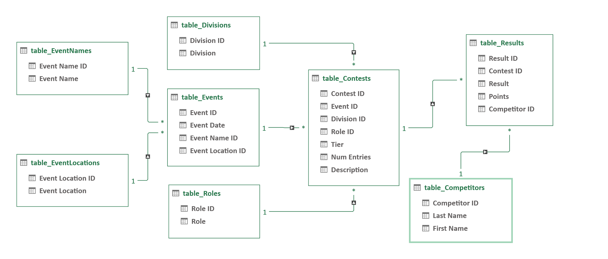

# Create Database Tables

## Database Schema

## Data Tables

The Master database tables are currently stored in individual CSV files, one for each table, derived from Excel data tables generated using [Power Query](https://learn.microsoft.com/en-us/power-query/power-query-what-is-power-query).

Currently, the "database" (CSV table files) are used "as-is", to generate a static web site (see the `generate_website` directory), which can easily be re-generated and re-deployed whenever the data is updated. The CSV files could also be used to set up a database in an actual database management system.

The tables should all be normalized with no data duplication among any tables.

All tables have a numeric primary key ID. Most start at 1, with exceptions such as Competitor ID and Division ID.

It should be obvious what datatype is used for each field: non-negative integer, text, or date.

### table_Competitors

Contains the CTST-assigned Competitor ID for each competitor, along with their name. Used only in `table_Results`.

- `Competitor ID` : Primary Key. Uniquely identifies a CTST Competitor.
This is the actual number assigned to a Competitor by the CTST once the Competitor earns their first point (or has a Result entry in the database even if no points were awarded).
The first assigned Competitor ID was 100. There are gaps in the Competitor ID assignments.

- `Competitor Name` : Competitor Name. Not referenced from other tables. Note that in some cases there may be competitors that have multiple Competitor IDs assigned for multiple variations of their name. Some work still needs to be done eliminating duplicate Competitor entries. One issue with this, however, is that some competitors have been signing up online through Country Dance Director, which maintains their CTST Competitor ID in their profile. Ideally, when eliminating a duplicate Competitor entry, it should not be the one they are currently using in their Country Dance Director profile.

### table_Contests

A Contest is a combination of an Event (e.g., 2019 Colorado Country Classic), in a given Division (Novice, Intermediate, etc.), for a given Role (Leader or Follower). Leader contests and Follower contests must be tracked separately since the points awarded to Leaders and Followers are based on the Contest Tier, which may be different for Leaders and Followers, and is determined by the total number of contestants that competed in that Division (in ALL heats) as a Leader or as a Follower.

- `Contest ID` : Primary Key. Uniquely identifies a Contest. Only used in `table_Results`.

- `Event ID` : from `table_Events`.

- `Division ID` : from `table_Divisions`.

- `Role ID` : from `table_Roles`.

- `Tier` : Contest Tier. Not referenced from other tables. Used as a record of which Tier was used when assigning competitor points at the time the contest was held. Not directly used to compute competitor points. Current Tier values:
    - `0` : Fewer than 5 entrants, or any non-pointed Contest (e.g., Masters or Sophisticated)
    - `1` : At least 5 but less than 13 entrants
    - `2` : At least 13 but less than 31 entrants
    - `3` : At least 31 entrants

    Currently, assignment of Tiers to Contests is considered a data entry function. Therefore, there is no separate Tier Table. This gives the flexibility to change the Tier points assignments in the future without affecting previously assigned points and Tier values. For legacy data (2020 results and earlier), the Tier value was solely derived from the Points assigned to the contest first-place winner in the Points Registry, as the number of leader/follower entries, and hence the Contest Tier, was not known in many cases.

- `Num Entries` : Number of contestants who competed (in ALL heats, not just the Finals). Not referenced from other tables.

    The total number of leaders or followers who competed in this contest. For legacy data (2020 results and earlier), this value was not used and was set to zero, as the leader/follower counts were not available for all contests.

- `Description` : Not presently used, but intended to add additional Contest information, e.g. can be used to indicate a combined-division contest, e.g., "Intermediate/Advanced", since for combined Contests, the Division ID in `table_Contests` will only be the lower of the two Divisions, i.e. the one in which points were awarded, and there is no other way in the database to denote a combined contest.

### table_Divisions

- `Division ID` : Primary Key. Uniquely identifies a Division. Only used in `table_Contests`. For ease of reporting and computing a competitor's currently-assigned Division, the non-pointed Divisions are grouped first, followed by the pointed Divisions ("Novice" and above). Gaps in the assigned IDs permit future divisions to be used, e.g., Juniors, Invitational.
    - `10` : Newcomer
    - `20` : Sophisticated
    - `30` : Masters
    - `40` : Novice
    - `50` : Intermediate
    - `60` : Advanced
    - `70` : All-Stars

- `Division` : Division Name. Note that because there have not yet been any "All-Stars" contests held so far, there may not yet be a table entry for "All-Stars".

### table_EventLocations

For consistency in reporting and use as a data entry lookup-table, each location in which an Event was held has its own table entry.

- `Event Location ID` : Primary Key. Uniquely identifies an Event's location. Only used in `table_Events`.

- `Event Location` : Event location (City, State; City, Province; or County, State).

### table_EventNames

For consistency in reporting and use as a data entry lookup-table, each named event has its own table entry. This is separate from `table_EventLocations` to allow events such as World's to be grouped without regard to the fact that the event was held in multiple locations.

- `Event Name ID` : Primary Key. Uniquely identifies a named Event. Used in `table_Events`.

- `Event Name` : Not used in other tables.

### table_Events

Each time an event is held there will be a separate Event entry for the Event on that date. If desired, other fields could be added to this table in the future, e.g., Event organizer name, contact info, web site, etc.

- `Event ID` : Primary Key. Uniquely identifies an event. Used in `table_Contests`.

- `Event Date` : The starting date of the Event.

- `Event Name ID` : from `table_EventNames`.

- `Event Location ID` : from `table_EventLocations`.

### table_Results

The lowest level of detail in the Points database is the Result record. A Result record is required for each placement in the Final heat of any Contest in which points are awarded. A Result entry is not required if no points were awarded. However, there is nothing to preclude creating a Result entry for all competitors in the Final heat, or for contests in the non-pointed divisions (e.g., Masters), as long as the competitor is assigned a Competitor ID. The Points value assigned to a Result is determined by the data entry function, and is not automatically derived from the Result/Tier. This allows future changes to the points/tier levels without affecting existing points awarded.

- `Result ID` : Primary Key. Uniquely identifies a result. Not used in other tables.

- `Contest ID` : from `table_Contests`.

- `Competitor ID` : from `table_Competitors`.

- `Result` : Competitor's placement in the Contest's Final heat (1 = First place winner, etc.)

- `Points` : Points assigned to the Competitor in the Contest based on the Leader/Follower Contest Tier.

### table_Roles

In the legacy Points Registry, each competitor was listed in EITHER the Men's OR the Women's Points Registry. The new database design is more flexible, and allows a Role to be used instead (L/F, Leader/Follower, Lead/Follow, etc.) Competitors can accrue points in either or both roles, as allowed by the rules in effect for each Event.

- `Role ID` : Primary Key. Uniquely identifies a Role, currently Leader (1) or Follower (2). Only used in `table_Contests`.

- `Role` : The name of the Role: "L" or "F".

## Database Creation

`create_db_tables.xlsx` is an Excel workbook that uses [Power Query](https://learn.microsoft.com/en-us/power-query/power-query-what-is-power-query) to generate the database tables.

This Excel workbook uses as its data source the CSV file, `points_combined.csv`, in the `create_csv_from_archive` directory, a combined file containing all Leader and Follower points data.

To (re-)generate the Excel data tables for the database in the Excel workbook, update the Data Source, then re-run the Power Query queries:

- Open the file, `create_db_tables.xlsx` in Excel
- If the message `SECURITY WARNING External Data Connections have been disabled` appears, click `Enable Content`
- Navigate to `Data > Get Data v > Data Source Settings...`
- Click `OK` to trust the source of the file
- In the Data source settings dialog, click on the entry for the `points_combined.csv` file
- Click `Change Source...`
- Select `Browse...` under File path
- Navigate to the directory containing the `points_combined.csv` file
- In the Import Data dialog, select the `points_combined.csv` file, then click `Import`, then `OK`, then `Close`
- On the Data ribbon, click `Queries & Connections`, then, still on the Data ribbon, click `Refresh All v`
- Wait for the data tables to finish loading on the Queries & Connections pane
- Click `File` then `Save` to save the updated workbook

The actual CSV files for the data tables are not written out automatically when Power Query is run. Each CSV file must be manually saved from its corresponding table/worksheet in the Excel workbook.

Open `create_db_tables.xlsx` in Excel, then for each of the `table_` worksheets (except for `base_data`):

- Select the `table_...` worksheet
- Click `File > Save As`
- Click `More options...`
- Under `Save as type:` select `CSV (Comma delimited) (*.csv)`, halfway down the list
- **IMPORTANT:** **DO NOT** select the **CSV UTF-8** type, which appears earlier in the list than the non-UTF-8 type
- Change the `File name`, e.g: `table_Competitors.csv`
- Navigate to the database directory, e.g. `db_tables_MASTER`
- Click `Save`, then `Yes` if overwriting an existing file, then `OK` to save only the active sheet

To view the actual Power Query queries used to generate the data tables, update the Data Source as described above, then:

- Open the file, `create_db_tables.xlsx` in Excel
- Navigate to `Data > Get Data v > Launch Power Query Editor...`
- Click `OK` to trust the source of the file
- Click on entries in the `Queries` list
  - `base_data` contains all Result records with all data fields filled in
  - Each `table_...` query is generated using `base_data` as a Reference query
  - The steps making up each query can be viewed under `APPLIED STEPS` in the Query Settings pane on the right
  - Some steps have a gear icon to view the dialog box used for that step
  - Expand the formula bar to see the details for a given step
  - Select `View > Advanced Editor` to view the details for all steps making up the selected query
